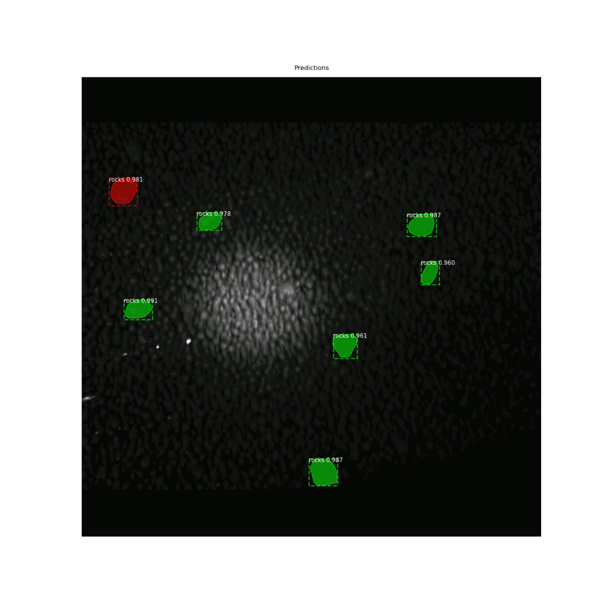

# "BigBalls" Detection And Segmentation Task


# Validation Set Run Gif Example

* Here Colored by **green** just "BigBalls" and by **red** "TheBiggestBigBalls"

# Dataset
In our course team we made up "handmade" markup for dataset by cvat.org
We prepare 85 frames for train and augmentation and 10 frames for validation


___
# Model
I use RCNN implementation from https://github.com/matterport/Mask_RCNN

# "How To"

## Train model
* Use CLI command to train from root repo folder
```
foo@bar:~$ python3 app/model.py --dataset=/path/to/train/dataset
```

## Evaluate the model
* Use CLI command to evaluate the model from root repo folder
```
foo@bar:~$ python3 app/model.py evaluate --dataset=/path/to/evaluation/dataset
```

## Deploy the model
1) Download repository
2) Download model file from GDrive and unzip to model/ folder
3) Install requirements.txt by pip or conda on you taste


___
# Custom metrics
* MSE of the number of abnormal clods.
  * Achieved on val_set MSE = 11.8
* MSE of the size of the biggest one


___ 
# Utilized resources
https://cvat.org/
https://engineering.matterport.com/splash-of-color-instance-segmentation-with-mask-r-cnn-and-tensorflow-7c761e238b46
https://colab.research.google.com/github/RomRoc/maskrcnn_train_tensorflow_colab/blob/master/maskrcnn_custom_tf_colab.ipynb#scrollTo=X7iSzccTL9hM
https://github.com/matterport/Mask_RCNN

## Creds 
* Eugene Borisov, 971901 HITS, email: evgenyboriso@gmail.com
